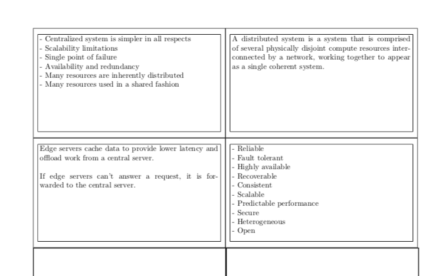

# flashcard-generator
Generate simple, double-sided, latex-formatted flashcards.

## How to use
```sh
python3 generate-flashcards.py <INPUT-FILE>
```
This will read in the input file, generate a tex-formatted flashcard file, and then compile the flashcard file to pdf using `pdflatex`.
Filenames are based off of the input file name; for example, `examples/example-flashcards.txt` will generate pdf file `examples/example-flashcards.pdf`

## Examples
```
python3 generate-flashcards.py examples/distributed-systems.txt
```
This will generate a file that looks like this:

#### Front


#### Back


## Dependencies 
flashcard-generator uses `python3` and `pdflatex`. 
You can install `pdflatex` using the instructions here: https://www.latex-project.org/get/

